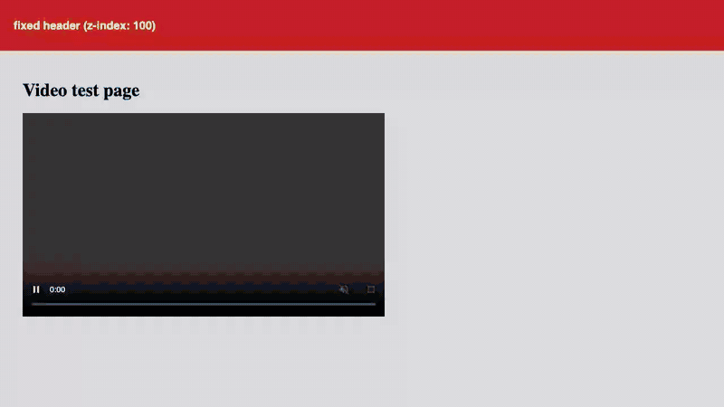

# Recordly

[](https://github.com/u1aryz/recordly/actions/workflows/ci.yml)
[](https://github.com/u1aryz/recordly/releases/latest)
[](../../LICENSE)

选中网页上的任意视频进行录制,并以 MP4 直接保存到磁盘 — 没有屏幕共享对话框,也没有重新编码的导出步骤。

[English](../../README.md) | [日本語](README_ja.md) | [Español](README_es.md) | [한국어](README_ko.md) | 简体中文



## 特性

- **点击选择视频** — 直接选中页面上要录制的 `<video>` 元素,无需共享标签页或屏幕。
- **MP4 直接保存到磁盘** — 通过 File System Access API 将录制数据直接写入所选保存位置,停止时没有导出或重新编码步骤。
- **支持长时间录制** — 录制数据按大约每 2GB 分割保存,长时间录制也安全。
- **录制 HUD 和进度页面** — 录制时页面上有 HUD,进度和下载可在 captures 页面查看。
- **支持 5 种语言** — English、日本語、Español、한국어、简体中文。

## 安装

Recordly 尚未上架 Chrome Web Store。请从 release 安装:

1. 从[最新 release](https://github.com/u1aryz/recordly/releases/latest) 下载 `recordly-x.x.x-chrome.zip` 并解压。
2. 打开 `chrome://extensions`,开启右上角的**开发者模式**。
3. 点击**加载已解压的扩展程序**,选择解压后的文件夹。

### 支持的浏览器

Recordly 面向 Chromium/Chrome,不支持 Firefox。它依赖 File System Access API(`showSaveFilePicker`)将录制数据直接写入保存位置,并依赖 `MediaRecorder` 的 MP4 输出;Firefox 无法以相同配置提供这些必需的功能。

## 使用方法

1. 在有视频的页面上点击扩展图标,使用弹出窗口中的"**选择此页面上要录制的视频**"。
2. 点击要录制的视频,在出现的菜单中选择"**选择文件夹并开始录制**",指定保存位置并开始录制。
3. 录制过程中可以在 captures 页面查看进度;停止后,MP4 将保存到指定的位置。

## 开发

前置条件:Node.js >= 22 和 pnpm。或者,也可以使用 [mise](https://mise.jdx.dev/) 通过 `mise install` 配置工具链。

```bash
pnpm install
pnpm dev        # 启动面向 Chromium/Chrome 的 WXT 开发服务器
pnpm build      # 构建扩展
```

### 测试

运行共享逻辑的单元测试(Vitest):

```bash
pnpm test
```

E2E 测试(Playwright)会将构建好的扩展加载到真实浏览器中,验证从选择视频到开始录制、保存 MP4 的完整流程。

```bash
pnpm test:e2e
```

首次运行 E2E 测试前,请先安装 Playwright 浏览器:

```bash
pnpm exec playwright install chromium
```

## 贡献

请参阅[贡献指南](../CONTRIBUTING.md)(英文)。本项目遵循[行为准则](../../CODE_OF_CONDUCT.md);如需报告安全漏洞,请参阅[安全策略](../../SECURITY.md)。Recordly 不收集任何用户数据;详情请参阅[隐私政策](../../PRIVACY.md)(英文)。

## 许可证

[MIT](../../LICENSE)
